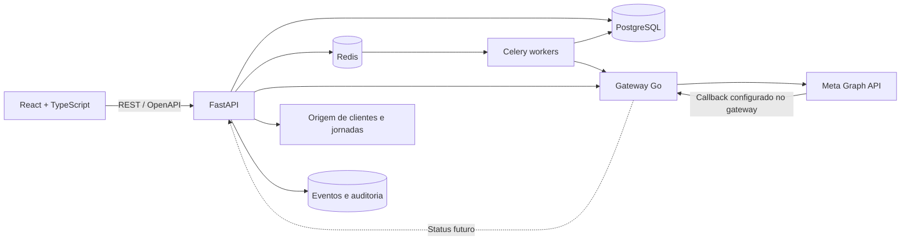

# Planejamento — Mensagem Direta via WhatsApp/Meta

> Integração inicial: Mensagem Direta → gateway Go → Meta. Mensagem Direta continua dona de WABA, templates, campanhas, consentimento e auditoria. O fluxo futuro será gateway → Meta → callback de status do gateway → Mensagem Direta; webhook de status do gateway fica fora deste passo.

## 1. Objetivo

Construir um serviço independente de mensagem direta que permita:

1. conectar uma WABA (WhatsApp Business Account) e um número da Cloud API;
2. sincronizar e consultar templates existentes na Meta;
3. criar, editar localmente e submeter novos templates para aprovação;
4. montar um público com regras fixas e visualizar a estimativa de alcance;
5. enviar imediatamente ou agendar uma campanha com template aprovado;
6. acompanhar aprovação do template e os estados de envio, entrega, leitura, resposta e falha;
7. registrar consentimento, opt-out, auditoria e evidências necessárias para LGPD.

O repositório começa vazio. A solução será greenfield e terá `backend` e `frontend` independentes.

## 2. Decisões de produto para o MVP

### 2.1 O que entra

- uma WABA por organização no primeiro release, preservando `organization_id` no modelo para expansão;
- templates nas categorias `MARKETING` e `UTILITY`;
- idioma inicial `pt_BR`;
- cabeçalho de texto ou imagem, corpo, rodapé, botões de resposta rápida e botões de ação compatíveis com a Meta;
- catálogo de "modelos prontos" mantido pela aplicação;
- aba "Minhas mensagens" alimentada pelos templates locais e sincronizados da WABA;
- filtros de público fixos, persistidos em formato versionado;
- envio imediato e agendado;
- processamento assíncrono, lotes, retentativas e cancelamento antes do despacho;
- webhook de status de template, status de mensagem e respostas recebidas;
- painel de resultados por campanha.

### 2.2 O que não entra no primeiro release

- construtor livre de regras/SQL;
- geração de texto por IA;
- otimização automática de horário e público;
- múltiplas WABAs por organização;
- WhatsApp Flows, catálogo de produtos e templates de autenticação;
- estratégia/oportunidades mostradas na primeira imagem;
- continuidade automática por agente após a resposta. No MVP, a resposta só gera evento e encaminhamento para o sistema responsável.

### 2.3 Regra importante do fluxo

Template criado ou alterado não pode ser enviado imediatamente. Primeiro ele é submetido à Meta, fica `PENDING` e só pode ser usado quando estiver `APPROVED`.

Por isso, a ação principal da etapa 2 muda conforme o estado:

- rascunho novo ou texto alterado: **Enviar para aprovação**;
- aprovado e sem alteração: **Enviar mensagem** ou **Agendar**;
- pendente: **Aguardando aprovação da Meta**;
- rejeitado: **Corrigir e reenviar**.

Um template aprovado deve ser tratado como uma revisão imutável dentro de uma campanha. Alterar o conteúdo cria nova revisão e exige nova aprovação.

## 3. Regras de público

No MVP, as regras vêm de um catálogo fixo; não haverá campo de expressão livre. A campanha armazena o conjunto de regras em JSON para permitir evolução sem migração de cada nova combinação.

### 3.1 Regras iniciais

| Regra | Definição técnica inicial | Tipo |
|---|---|---|
| Elegível e não fechou | `eligible = true AND deal_status NOT IN ('won', 'closed')` | obrigatória |
| Uma semana sem resposta | última resposta do cliente anterior ou igual a `agora - 7 dias` | opcional |
| Noventa dias sem resposta | última resposta do cliente anterior ou igual a `agora - 90 dias` | opcional |
| Menos de 3 mensagens diretas | total de mensagens diretas aceitas pela Meta nos últimos 90 dias menor que 3 | opcional |

As regras marcadas são cumulativas (`AND`). A regra de 90 dias já contém a condição de 7 dias; se as duas forem marcadas, o backend normaliza para 90 dias e o frontend exibe um aviso. Depois de validar o comportamento real, a interface pode trocar os dois checkboxes por uma única regra “sem resposta” com escolha de 7 ou 90 dias.

### 3.2 Guardas obrigatórias, mesmo que não apareçam como checkbox

- telefone válido e normalizado em E.164;
- consentimento vigente para a categoria da comunicação;
- não constar na lista de opt-out/bloqueio;
- não ter negócio fechado após a montagem do público;
- possuir todos os valores exigidos pelas variáveis do template;
- no máximo três templates consecutivos por empresa e telefone; qualquer mensagem
  recebida do usuário zera o contador local;
- não ter recebido a mesma campanha;
- não estar em supressão operacional ou jurídica.

### 3.3 Momento da avaliação

1. **Preview:** consulta somente para mostrar contagem e amostra anonimizada.
2. **Materialização:** ao confirmar, cria a lista de destinatários da campanha e registra a explicação da elegibilidade.
3. **Revalidação:** imediatamente antes do envio de cada destinatário, reaplica as guardas obrigatórias. Isso evita enviar para alguém que fechou, revogou consentimento ou respondeu depois da seleção.

### 3.4 Regra futura de agentes pós-jornada

Não bloquear o MVP por essa decisão. Reservar no contrato uma regra `post_journey_agent_flag`, desativada por feature flag. Ela só será implementada quando a origem, semântica e responsável pelo flag estiverem definidos.

## 4. Arquitetura proposta



### 4.1 Backend

- Python 3.12;
- FastAPI e Pydantic;
- SQLAlchemy 2 assíncrono e Alembic;
- PostgreSQL como fonte de verdade;
- Redis + Celery para fila, agendamentos e retentativas;
- `httpx` para adapters Meta e gateway Go;
- logs estruturados, métricas e tracing;
- testes com `pytest`, `pytest-asyncio` e `respx`;
- configuração por ambiente com `pydantic-settings`;
- token da Meta cifrado em repouso ou fornecido por secret manager.

### 4.2 Frontend temporário

- React + TypeScript + Vite;
- React Router;
- TanStack Query para estado remoto;
- React Hook Form + Zod para formulários;
- cliente TypeScript gerado do OpenAPI do backend;
- tokens visuais próprios para reproduzir a interface escura das referências sem acoplar o produto a um design system definitivo.

O frontend não calcula elegibilidade, não monta payload final da Meta e não executa agendamentos. Ele solicita preview, validação e execução ao backend.

### 4.3 Processos implantáveis

- `api`: FastAPI;
- `worker`: envio, sincronização e processamento pesado;
- `scheduler`: Celery Beat ou processo equivalente;
- `frontend`: build estático independente;
- `postgres` e `redis`: serviços de infraestrutura.

## 5. Estrutura do repositório

```text
gerenciamento_templates/
├── backend/
│   ├── app/
│   │   ├── api/v1/                 # rotas e dependências HTTP
│   │   ├── core/                   # settings, segurança, logs e observabilidade
│   │   ├── domain/                 # entidades e regras puras
│   │   ├── models/                 # modelos SQLAlchemy
│   │   ├── schemas/                # contratos Pydantic
│   │   ├── repositories/           # acesso a banco
│   │   ├── services/               # casos de uso
│   │   ├── integrations/
│   │   │   ├── meta/               # Graph API, DTOs e tradução de erros
│   │   │   └── audience_source/    # adapter da origem comercial/jornada
│   │   ├── workers/                # tasks Celery
│   │   └── main.py
│   ├── migrations/
│   ├── tests/
│   │   ├── unit/
│   │   ├── integration/
│   │   └── contract/
│   ├── pyproject.toml
│   ├── Dockerfile
│   └── .env.example
├── frontend/
│   ├── src/
│   │   ├── api/                    # cliente gerado e adaptadores
│   │   ├── app/                    # router e providers
│   │   ├── components/             # UI compartilhada
│   │   ├── features/
│   │   │   ├── templates/
│   │   │   ├── campaigns/
│   │   │   ├── audiences/
│   │   │   └── results/
│   │   ├── pages/
│   │   ├── styles/
│   │   └── main.tsx
│   ├── tests/
│   ├── package.json
│   ├── Dockerfile
│   └── .env.example
├── contracts/                      # snapshots OpenAPI e payloads de exemplo
├── docs/                           # ADRs, fluxos e runbooks
├── compose.yaml                    # desenvolvimento local
├── Makefile ou scripts equivalentes
└── README.md
```

Não haverá importação de código entre `backend/` e `frontend/`. O compartilhamento acontece apenas pelo OpenAPI versionado.

## 6. Integração com a Meta

### 6.1 Operações principais

| Ação | Graph API |
|---|---|
| Listar/sincronizar templates | `GET /{WABA_ID}/message_templates` |
| Criar/submeter template | `POST /{WABA_ID}/message_templates` |
| Enviar template aprovado | `POST /{PHONE_NUMBER_ID}/messages` com `type=template` |
| Inscrever app nos webhooks da WABA | `POST /{WABA_ID}/subscribed_apps` |
| Receber aprovação/rejeição | webhook `message_template_status_update` |
| Receber envio/entrega/leitura/falha e respostas | webhook `messages` |

A versão da Graph API será uma configuração, nunca uma constante espalhada pelo código.

### 6.2 Adapter da Meta

Criar uma interface interna `WhatsAppProvider` para que o domínio não dependa dos DTOs da Meta:

- `list_templates(cursor)`;
- `create_template(command)`;
- `delete_template(meta_template_id)` quando habilitado;
- `upload_template_asset(file)`;
- `send_template(command)`;
- `subscribe_webhooks()`;
- `verify_webhook_challenge()`;
- `parse_webhook(payload)`.

O adapter deve traduzir erros da Meta para classes internas: autenticação, permissão, rate limit, template não aprovado, payload inválido, destinatário inválido e erro transitório.

### 6.3 Sincronização

- sincronização manual por botão;
- sincronização periódica;
- paginação completa;
- upsert por `meta_template_id + language`;
- webhook como atualização rápida;
- reconciliação periódica como proteção contra webhook perdido;
- Meta é a fonte de verdade para `status`, `category` e qualidade;
- aplicação é a fonte de verdade para nome amigável, tags, aliases das variáveis e modelos prontos.

### 6.4 Variáveis

Na interface, usar aliases como `{{nome}}` e `{{produto}}`. Antes de submeter à Meta, compilar para posições `{{1}}`, `{{2}}` e guardar o mapa estável:

```json
{
  "1": {"alias": "nome", "source": "contact.first_name", "required": true},
  "2": {"alias": "produto", "source": "deal.product_name", "required": true}
}
```

Cada variável precisa de exemplo na submissão e de valor resolvido antes do envio. Nunca preencher variável ausente com string vazia sem autorização explícita.

## 7. Modelo de dados inicial

### `organizations`

Isolamento lógico, configurações e fuso horário.

### `waba_connections`

`organization_id`, `business_id`, `waba_id`, `phone_number_id`, versão da API, referência ao segredo, estado da conexão e timestamps da última sincronização.

### `message_templates`

ID local, ID Meta, nome, idioma, categoria, status, qualidade, componentes JSON, schema de variáveis, revisão, origem (`META`, `LOCAL`, `PRESET`) e motivo de rejeição.

### `template_presets`

Catálogo dos modelos prontos exibidos nas telas, com tags, orientação de uso, riscos e conteúdo-base.

### `campaigns`

Nome, template/revisão, regras de público versionadas, modo de envio, agendamento, fuso, estado, usuário criador e totais agregados.

Estados: `DRAFT`, `VALIDATING`, `SCHEDULED`, `QUEUED`, `SENDING`, `COMPLETED`, `PARTIAL_FAILURE`, `CANCELLED`, `FAILED`.

### `campaign_recipients`

Campanha, ID externo do contato, telefone cifrado ou protegido, hash para deduplicação, snapshot mínimo de variáveis, explicação de elegibilidade, `wamid`, estado e erro.

Estados: `SELECTED`, `SUPPRESSED`, `QUEUED`, `ACCEPTED`, `SENT`, `DELIVERED`, `READ`, `REPLIED`, `FAILED`, `OPTED_OUT`.

### `consents` e `opt_outs`

Categoria, origem, evidência, data, revogação e escopo. Opt-out sempre prevalece sobre qualquer regra de campanha.

### `message_events`

Eventos normalizados dos webhooks, com chave de idempotência, timestamp da Meta e payload bruto com retenção limitada.

### `audit_logs`

Quem criou, alterou, submeteu, agendou, iniciou, cancelou ou exportou dados.

## 8. API do backend

Prefixo: `/api/v1`.

### Conexão

- `GET /meta/connection`
- `POST /meta/connection/test`
- `POST /meta/webhooks/subscribe`
- `GET /webhooks/meta` — challenge de verificação
- `POST /webhooks/meta` — eventos assinados/idempotentes

### Templates

- `GET /templates`
- `GET /templates/{template_id}`
- `POST /templates/drafts`
- `PUT /templates/{template_id}/draft`
- `POST /templates/{template_id}/submit`
- `POST /templates/sync`
- `GET /template-presets`
- `POST /template-presets/{preset_id}/clone`
- `POST /template-assets`

### Público e campanhas

- `POST /audiences/preview`
- `POST /campaigns`
- `GET /campaigns`
- `GET /campaigns/{campaign_id}`
- `PUT /campaigns/{campaign_id}` enquanto rascunho
- `POST /campaigns/{campaign_id}/validate`
- `POST /campaigns/{campaign_id}/schedule`
- `POST /campaigns/{campaign_id}/send`
- `POST /campaigns/{campaign_id}/cancel`
- `GET /campaigns/{campaign_id}/results`
- `GET /campaigns/{campaign_id}/recipients` com acesso restrito

Todas as operações de criação/disparo recebem `Idempotency-Key`. Preview e validação retornam erros estruturados por regra e por variável.

## 9. Telas e comportamento

### 9.1 Catálogo

- abas `Minhas mensagens` e `Modelos prontos`;
- filtros por categoria, status e presença de imagem;
- card com conteúdo resumido, status Meta, categoria, idioma e alcance estimado apenas quando houver contexto de público;
- ações `Ver`, `Usar`, `Duplicar`, `Sincronizar` e, quando seguro, `Excluir`;
- modal de preview semelhante à referência, deixando claro se é exemplo ou template aprovado.

### 9.2 Wizard de campanha — etapa 1, Público e momento

- nome da campanha;
- produto;
- checkboxes de regras;
- envio agora ou agendamento com fuso explícito;
- contagem calculada pelo backend;
- resumo do público e motivos de supressão;
- preview não pode expor CPF ou telefone completo.

### 9.3 Wizard — etapa 2, Mensagem

- seleção de template aprovado ou criação a partir de modelo pronto;
- cabeçalho/imagem, título, corpo, rodapé e botões;
- contador e validação seguindo limites retornados/configurados para a Meta;
- aliases de variável e origem de cada valor;
- preview claro/escuro;
- CTA coerente com o estado de aprovação descrito na seção 2.3.

### 9.4 Resultados

- selecionados, suprimidos, aceitos, enviados, entregues, lidos, respondidos e falhos;
- taxas calculadas com denominadores visíveis;
- erros agrupados por código;
- linha do tempo da campanha;
- exportação somente com permissão e auditoria.

## 10. Pipeline de envio

1. validar que a revisão do template continua aprovada;
2. materializar destinatários e criar snapshot mínimo;
3. revalidar guardas obrigatórias;
4. gerar payload a partir do mapa de variáveis;
5. enfileirar em lotes pequenos;
6. enviar com idempotência interna e limite de concorrência configurável;
7. gravar o `wamid` retornado;
8. aplicar retentativa somente para falhas transitórias, com backoff e jitter;
9. nunca repetir automaticamente erro permanente;
10. consumir webhook idempotentemente e permitir eventos fora de ordem;
11. fechar campanha quando não houver destinatário pendente e consolidar métricas.

O estado nunca deve regredir: por exemplo, um webhook `sent` atrasado não volta uma mensagem de `delivered` para `sent`.

## 11. Segurança, LGPD e política de mensagens

- base legal e opt-in documentados por categoria;
- opt-out por resposta como `SAIR`, variações configuradas e solicitação vinda de outros canais;
- bloqueio imediato após opt-out, antes de qualquer novo envio;
- proibir CPF, número de conta, credencial e outros identificadores sensíveis no template, log e evento;
- minimizar snapshots de destinatário e definir prazo de retenção;
- telefone mascarado na UI e ausente dos logs comuns;
- criptografia em trânsito e em repouso;
- segredos fora do banco em texto puro e fora do frontend;
- RBAC: visualizador, operador e administrador;
- trilha de auditoria para ações sensíveis;
- assinatura/verificação do webhook e proteção contra replay;
- endpoint de webhook responde rápido e delega processamento à fila;
- rate limit interno e circuit breaker para a Meta;
- processo de exclusão/anonimização por solicitação do titular;
- revisão jurídica dos textos relacionados a crédito antes da produção.

## 12. Testes

### Unitários

- composição e normalização das regras;
- revalidação de elegibilidade;
- compilação aliases → posições;
- máquina de estados de template, campanha e destinatário;
- classificação de erros e política de retry;
- bloqueio por consentimento/opt-out.

### Integração

- banco e migrações;
- Redis/Celery;
- adapter Meta com respostas mockadas;
- paginação e upsert da sincronização;
- webhook duplicado e fora de ordem;
- materialização e deduplicação de público.

### Contrato e ponta a ponta

- snapshot OpenAPI e geração do cliente React;
- listar, criar, submeter e aprovar template simulado;
- preview de público;
- enviar uma campanha de teste;
- receber estados e resposta;
- opt-out impede campanha posterior.

## 13. Fases de entrega

### Fase 0 — contratos e spike da Meta

- validar credenciais, WABA, número e permissões;
- documentar origem dos dados de elegibilidade;
- confirmar payloads reais de template, mídia, envio e webhook;
- criar ADRs das decisões principais.

**Saída:** script/cliente de prova capaz de listar templates e enviar `hello_world` para um número de teste.

### Fase 1 — fundação

- scaffold separado de backend e frontend;
- banco, migrações, Redis e containers locais;
- autenticação/autorização mínima;
- observabilidade, CI, lint e testes base;
- OpenAPI e geração do cliente React.

### Fase 2 — gestão de templates

- conexão Meta;
- sincronização paginada;
- modelos prontos;
- rascunho, validação, mídia, submissão e estados;
- webhook de aprovação/rejeição;
- catálogo e modal de preview.

### Fase 3 — público

- adapter da origem comercial;
- catálogo de regras fixas;
- preview, explicações, deduplicação e supressões;
- consentimentos e opt-outs;
- tela da etapa 1.

### Fase 4 — campanha e envio

- criação, validação, agendamento e cancelamento;
- materialização, revalidação e workers;
- rate limit, idempotência e retries;
- tela da etapa 2 e preview.

### Fase 5 — retorno e operação

- webhooks de mensagem e resposta;
- resultados e erros;
- auditoria e alertas;
- runbook operacional e reconciliação.

### Fase 6 — hardening e piloto

- testes de carga controlados;
- revisão de segurança/LGPD;
- homologação com público interno pequeno;
- limites graduais e feature flag;
- aceite antes da expansão.

## 14. Critérios de aceite do MVP

1. Um operador sincroniza os templates reais da WABA e enxerga status correto.
2. Um operador cria um template, acompanha `PENDING` e recebe `APPROVED` ou `REJECTED` sem atualização manual.
3. Apenas template aprovado pode ser selecionado para disparo.
4. O preview de público retorna contagem, regras aplicadas e supressões sem expor PII indevida.
5. Um contato inelegível entre preview e disparo é suprimido na revalidação.
6. Uma campanha não envia duas vezes ao mesmo contato.
7. Opt-out impede qualquer novo envio aplicável.
8. O sistema registra `wamid` e atualiza enviado, entregue, lido, respondido ou falho por webhook.
9. Reiniciar API ou worker não perde campanha nem duplica envio confirmado.
10. Toda ação de template e campanha relevante possui auditoria.

## 15. Decisões pendentes antes da implementação

1. Qual sistema é a fonte dos campos `eligible`, `deal_status`, `last_customer_reply_at`, produto e flag pós-jornada?
2. “Menos de 3 mensagens” considera toda a vida, janela de 90 dias ou janela móvel diferente?
3. “Sem resposta” conta a partir da última mensagem enviada, da última conversa ou do fim da jornada?
4. Quem assume a conversa quando o cliente responde e qual identificador deve ser enviado ao sistema de agentes?
5. O MVP será single-tenant de fato ou já precisa operar múltiplas empresas?
6. Qual provedor de identidade/JWT o frontend temporário usará?
7. A conexão inicial usará token de system user configurado pelo administrador ou Embedded Signup?
8. Qual política de retenção e quais papéis podem exportar destinatários?
9. Quais palavras e canais contam como opt-out além de `SAIR`?
10. Quais categorias de crédito e textos foram aprovados pelo jurídico/compliance?

## 16. Referências oficiais

- [Coleção oficial da Meta — templates](https://www.postman.com/meta/whatsapp-business-platform/folder/lczy75a/templates)
- [Coleção oficial da Meta — envio de template interativo](https://www.postman.com/meta/whatsapp-business-platform/request/lwtlz1k/send-message-template-interactive)
- [Coleção oficial da Meta — payloads de webhook](https://www.postman.com/meta/whatsapp-business-platform/folder/vzaxn16/webhook-payload-reference)
- [Política de mensagens do WhatsApp Business](https://whatsappbusiness.com/policy/)

